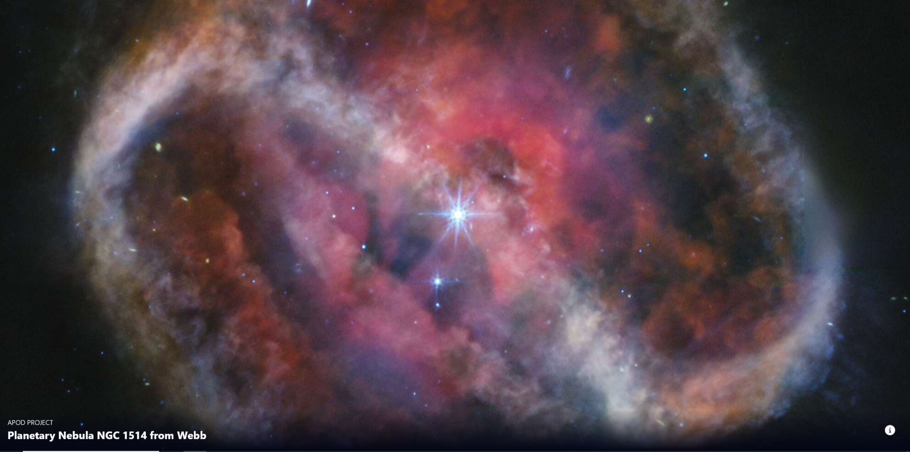
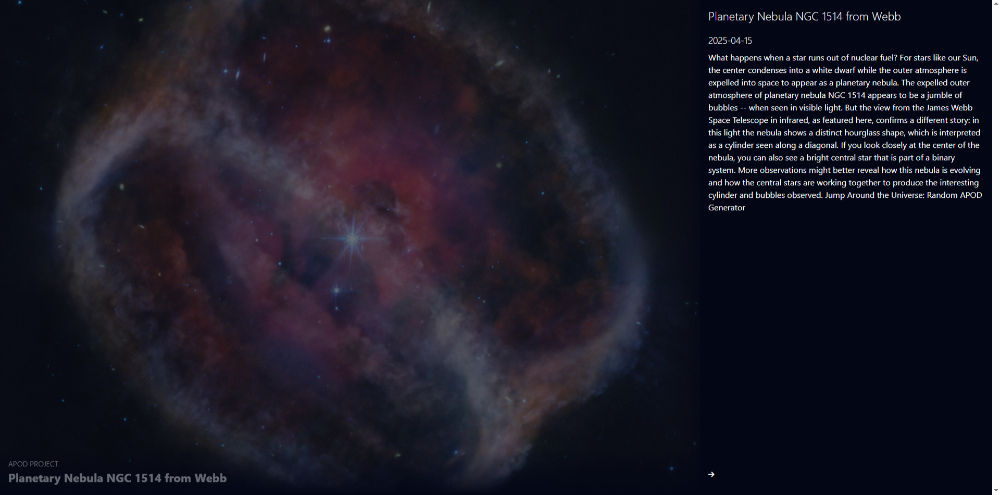

# 🚀 NASA Astronomy Picture of the Day (APOD) Website

A web application that displays the **Astronomy Picture of the Day (APOD)** using NASA's official API. The website dynamically fetches breathtaking space photographs along with their detailed explanations — updated daily!

---

## 🌌 Features

- Fetches and displays the latest **Astronomy Picture of the Day** from NASA.
- Displays high-resolution space images.
- Includes title, date, and a detailed explanation for each image.
- Seamless and responsive UI for all devices.
- Built with modern web technologies.

---

## 🛠️ Tech Stack

- ⚛️ **React.js** — Frontend library
- ⚡ **Vite** — Lightning-fast build tool
- 💅 **CSS** — Custom responsive styling
- 🔗 **NASA Open API** — Data Source

---

## 💻 Demo

> No live demo for this project.  
Please refer to the screenshots below for a visual overview!

---

## 📸 Screenshots

| Home Page |
|-----------|
|  |

| Image Detail Example |
|----------------------|
|  |

---

## 🚀 Getting Started

1. Clone the repository:
```bash
git clone https://github.com/RatulSen555/nasa-apod-website.git


